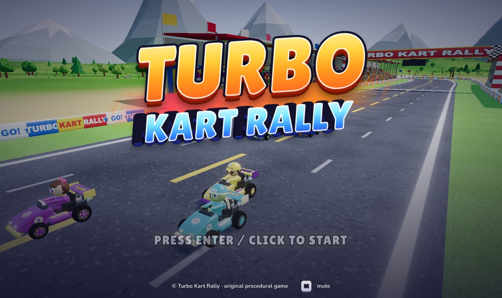
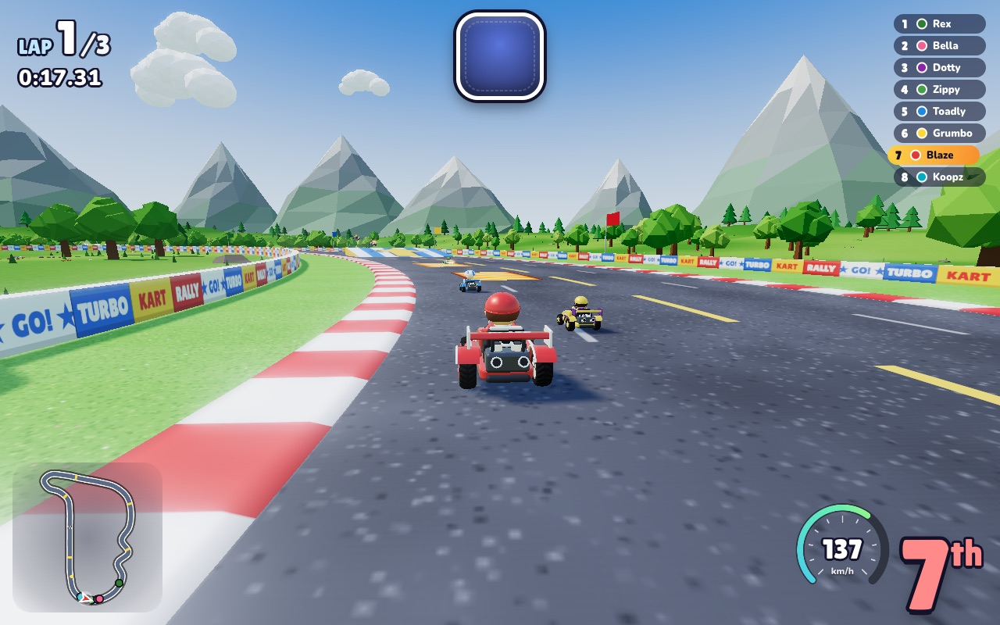
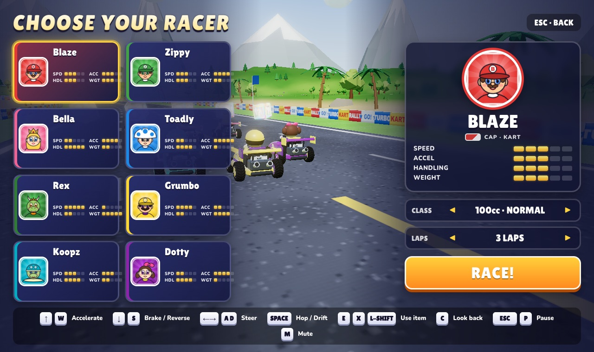
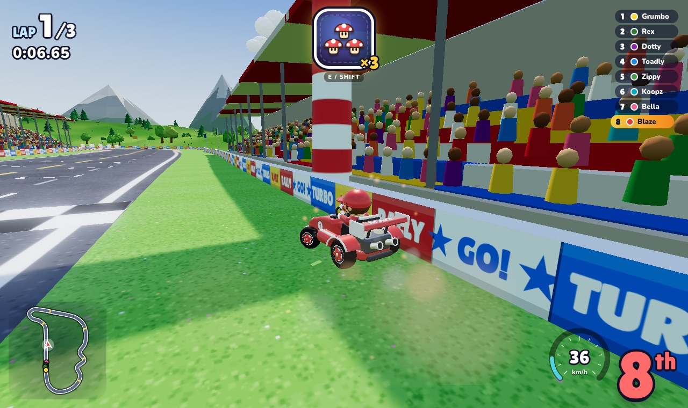
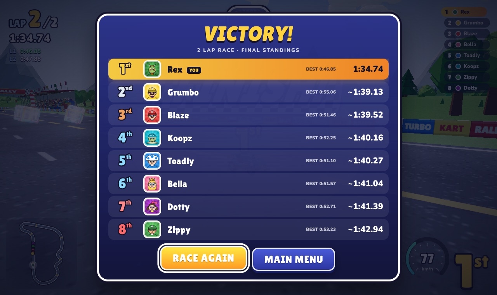

# Neon Rift Racers

<p align="center">
  
</p>

<p align="center">
  <strong>Break the track. Rule the rift.</strong><br />
  A fast, original 3D arcade kart racer built for the browser.
</p>

<p align="center">
  
  
  
  
</p>

## About

Neon Rift Racers combines responsive arcade handling, tactical abilities and a vivid low-poly world in a lightweight WebGL experience. Choose from eight pilots, master drifting and mini-turbos, and race seven AI rivals around Nova Harbor.

The game runs directly in a modern desktop or mobile browser. Its vehicles, environments, effects and audio are generated at runtime, keeping the project portable and easy to develop locally.

## Screenshots

| Racing | Pilot selection |
| --- | --- |
|  |  |

| Tactical abilities | Results |
| --- | --- |
|  |  |

## Features

- Eight pilots with distinct speed, acceleration, handling and weight profiles
- Arcade driving with hops, drifting, mini-turbos, boost ramps and collisions
- Seven AI opponents with racing lines, tactical ability use and adaptive pace
- Chase, front, wide and rear-view camera modes
- Keyboard, gamepad and responsive on-screen controls
- Switchable directional buttons and analog steering-wheel input on touch devices
- Expandable tactical minimap and contextual ability HUD
- Runtime-generated 3D vehicles, scenery, visual effects and Web Audio soundtrack
- Animated neon interface powered by GSAP

## Getting Started

### Prerequisites

- [Node.js](https://nodejs.org/) 20 or newer
- A modern browser with WebGL support

### Installation

```bash
git clone https://github.com/RonitkumarSoni/game.git
cd game
npm install
npm run dev
```

Open the local URL printed by Vite, then select a pilot to begin racing.

### Production build

```bash
npm run build
npm run preview
```

## Controls

| Action | Keyboard | Gamepad |
| --- | --- | --- |
| Accelerate | `W` / `Arrow Up` | `A` / Right trigger |
| Brake / reverse | `S` / `Arrow Down` | `B` / Left trigger |
| Steer | `A` `D` / Arrow keys | Left stick |
| Hop / drift | `Space` | `RB` / `X` |
| Use ability | `E` / `X` / `Left Shift` | `LB` / `Y` |
| Rear view | `C` | Stick click |
| Pause | `Esc` / `P` | Start |
| Mute | `M` | — |

Touch controls place steering on the left and driving actions on the right. The in-race switch lets players choose directional steering or the analog wheel without interrupting the race.

## Development

```bash
npm run typecheck   # TypeScript validation
npm test            # Unit test suite
npm run lint        # Source linting
npm run build       # Production bundle
```

### Project layout

```text
src/          gameplay, rendering, audio and interface systems
src/core/     reusable event, pooling and randomization utilities
tests/unit/   deterministic unit tests
public/       public browser assets
docs/         screenshots and project media
dev/          isolated gameplay test pages
```

For a deeper technical overview, see [ARCHITECTURE.md](ARCHITECTURE.md).

## Technology

- [Three.js](https://threejs.org/) for WebGL rendering and 3D scenes
- [TypeScript](https://www.typescriptlang.org/) for typed game systems
- [GSAP](https://gsap.com/) for interface motion
- [Vite](https://vite.dev/) for development and production builds
- [Vitest](https://vitest.dev/) for unit testing

## Author

Designed and developed by [RonitkumarSoni](https://github.com/RonitkumarSoni).

## License

Distributed under the MIT License. See [LICENSE](LICENSE) for details.
